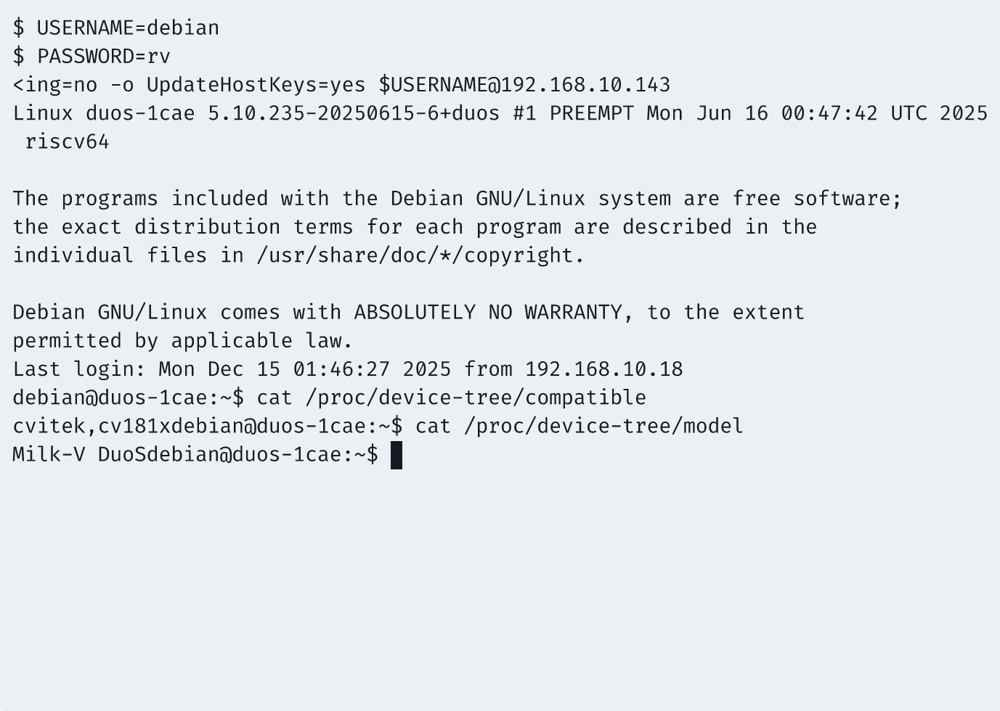
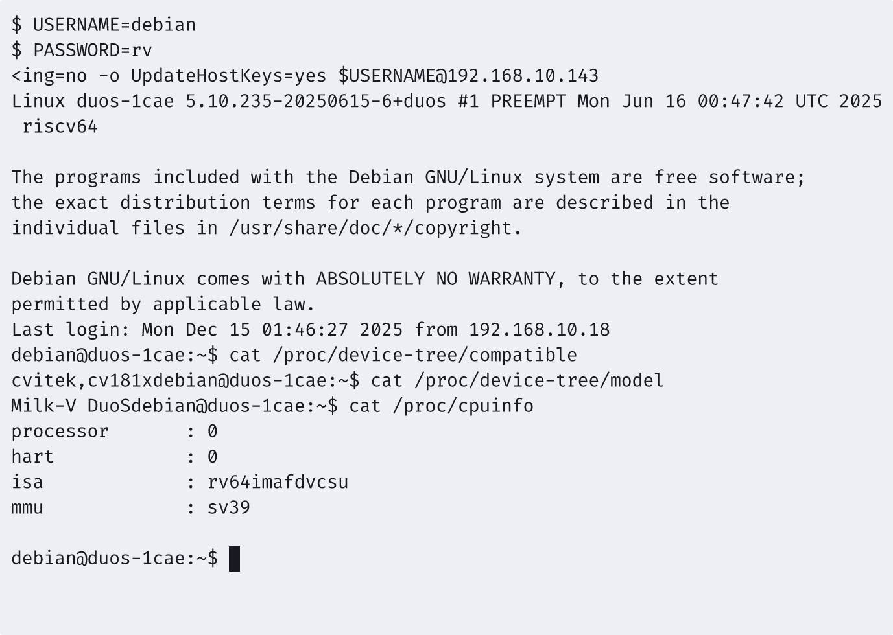
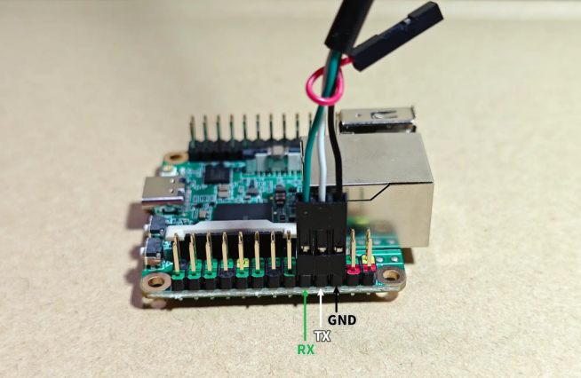
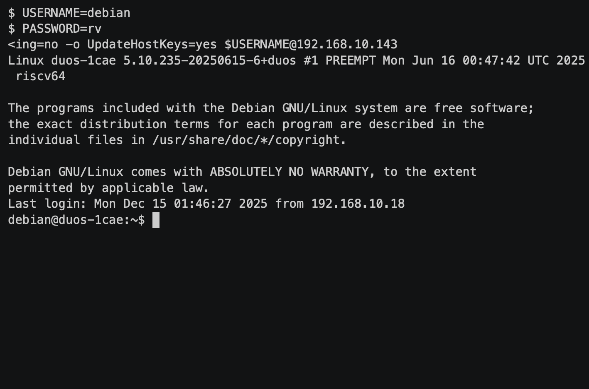

# 快速开始
## 操作系统安装与启动验证
### 操作系统信息

- 系统版本：Debian v1.6.35
- 下载链接：<https://github.com/scpcom/sophgo-sg200x-debian/releases/tag/v1.6.35>
- 参考安装文档：<https://github.com/scpcom/sophgo-sg200x-debian>

### 硬件信息

- Milk-V Duo S (512M, SG2000)
	- 设备照片
	- 设备型号截图
	- 系统信息截图
- USB 电源适配器一个
- USB-A to C 或 USB C to C 线缆一条，用于给开发板供电
- microSD 卡一张
- USB 读卡器一个
- USB to UART 调试器一个
- 杜邦线三根

## 操作系统安装与启动验证

### 下载 Duo S 的镜像

```bash
wget https://github.com/scpcom/sophgo-sg200x-debian/releases/download/v1.6.35/duos-e_sd.img.lz4
lz4 -dk duos-e_sd.img.lz4
```

### 刷写镜像

用 dd 刷写镜像到 sd 卡：
```shell
sudo dd if=duos-e_sd.img of=/dev/sdX bs=1M status=progress
```
### 登录系统
#### 通过串口连接
将 microSD 卡插入 Milk-V Duo S，重启。

开发板串口通过杜邦线与调试模块连接；黑色箭头指的为GND，白色箭头指的为TX，绿色箭头指的为RX。（连接方式为：开发板GND->调试器GND，开发板TX->调试器RX，开发板RX->调试器TX


#### 打开终端，使用 minicom 或 tio 连接串口

```
minicom -D /dev/ttyACM0 -c on

默认用户名：`root`
默认密码：`milkv`
```
重新给开发板上电，连接网口，等待开机



## RuyiSDK 环境初始化

### 安装 ruyi

安装依赖包

```
sudo apt update; sudo apt install -y wget tar zstd xz-utils git build-essential
```

安装 ruyi 包管理器

```
wget https://mirror.iscas.ac.cn/ruyisdk/ruyi/tags/0.41.0/ruyi-0.41.0.riscv64

chmod +x ruyi-0.41.0.riscv64

sudo cp -v ruyi-0.41.0.riscv64 /usr/local/bin/ruyi
```

### 使用 ruyi 安装工具链

安装 GCC 和 LLVM 工具链

```
ruyi update

ruyi install gnu-plct llvm-plct
```