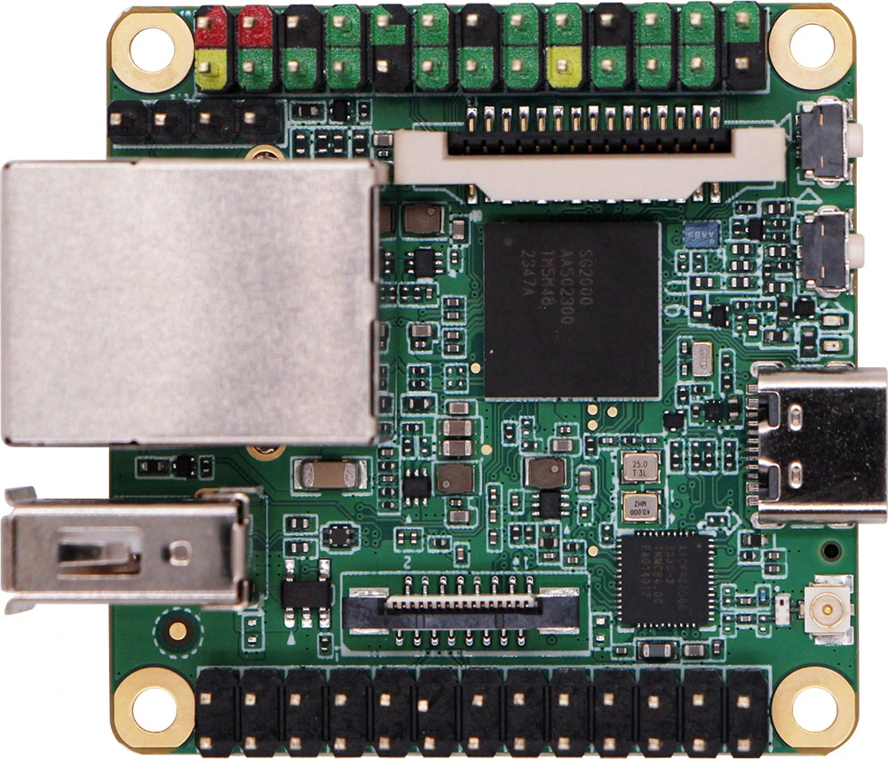

# Milk-V Duo S 概述

## 概述

Milk-V DuoS 是 Duo 的升级型号，升级了 SG2000 主控，拥有更大的内存（512MB）和更多的 IO 接口。 它集成了 WI-FI 6/BT 5 无线功能，并配备 USB 2.0 HOST 接口和 100Mbps 以太网端口，方便用户使用。 它支持双摄像头（2x MIPI CSI 2 通道）和 MIPI 视频输出（MIPI DSI 4 通道），可实现多种应用。 DuoS 还支持通过开关在 RISC-V 和 ARM 启动之间切换。 通过性能和接口的增强，DuoS 更适合各种场景和更复杂的项目开发需求。

## 硬件规格

- **处理器**: SG2000(C906@1Ghz + C906@700MHz)
- **内存**: SIP DRAM 512MB
- **存储**: 1x microSD connector , 1x eMMC Pad on board
- **接口**: 
	- 1 x Type-C for power and data or 1x USB 2.0 A Port HOST  (Note: Cannot be used at the same time, supports switching via terminal commands)
	- 1x 16P FPC connector (MIPI CSI 2-lane)
	- 1x 15P FPC connector (MIPI CSI 2-lane)
- **电源**: USB‑C 5V

